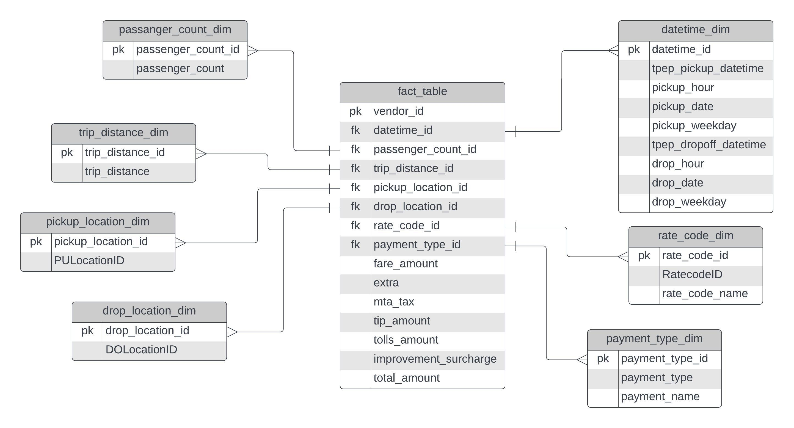
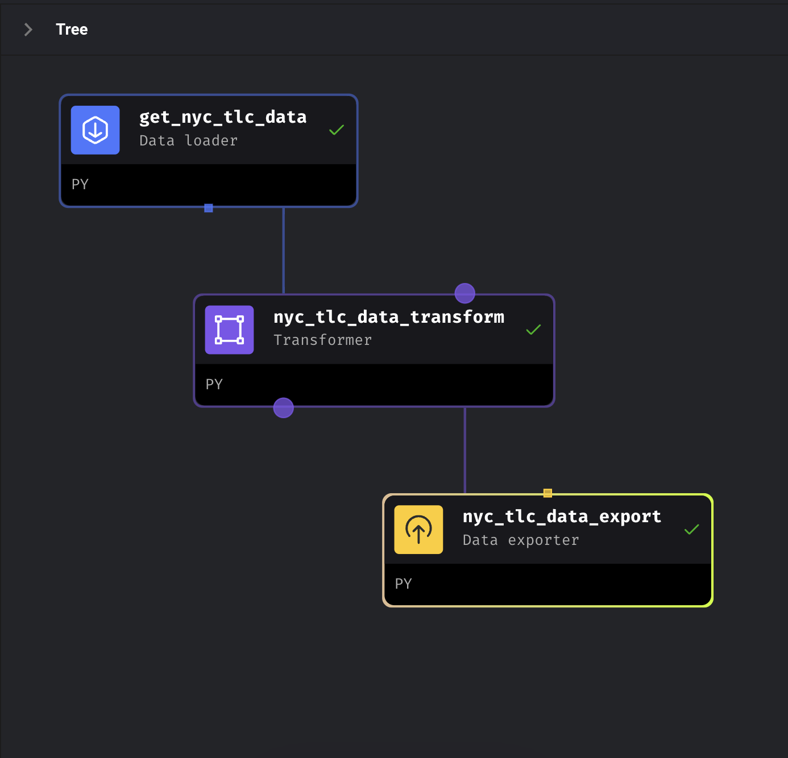
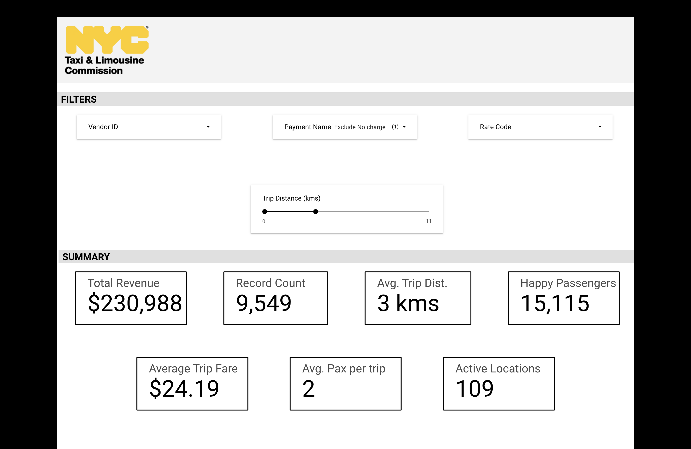

# New York City Taxi and Limousine Commission Department Data Analytics

The goal of the project was to create a data engineering pipeline using the NYC TLC Rideshare data and create a final dashboard to perform the analytics.

Technologies Used:
- Python3 and Jupyter Notebook to understand and transform the data.
- Google Cloud Storage Bucket to store the data.
- Google Cloud Compute Engine integrated with [Mage](https://www.mage.ai) (A modern replacement of Apache Airflow) to build the data pipeline.
- Google Cloud BigQuery to store the database and create analytical layer.
- Google Looker Studio to build the final dashboard.

## Data Model

## Mage Data Pipeline

## Looker Studio Dashboard

